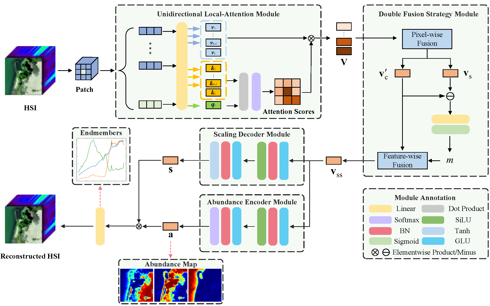

# Unidirectional Local-Attention Autoencoder Network for Spectral Variability Unmixing


**Demo code for "[Unidirectional Local-Attention Autoencoder Network for Spectral Variability Unmixing](https://ieeexplore.ieee.org/document/10464351)"**





**If you use the code in your research, we would appreciate a citation to the original paper:**


```
@ARTICLE{10464351,
  author={Xiang, Shu and Li, Xiaorun and Ding, Jigang and Chen, Shuhan and Hua, Ziqiang},
  journal={IEEE Transactions on Geoscience and Remote Sensing}, 
  title={Unidirectional Local-Attention Autoencoder Network for Spectral Variability Unmixing}, 
  year={2024},
  volume={62},
  number={},
  pages={1-15},
  keywords={Feature extraction;Decoding;Transformers;Hyperspectral imaging;Computational modeling;Perturbation methods;Data mining;Autoencoder (AE) network;hyperspectral unmixing;multihead attention mechanism;spectral variability;spectral–spatial model},
  doi={10.1109/TGRS.2024.3375598}
  }
```


